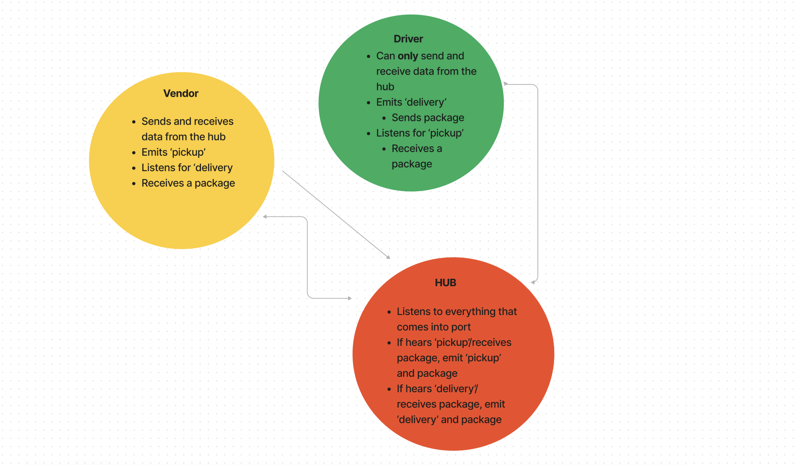

# CAPS aka the Code Academy Parcel Service

[CAPS system overview](https://codefellows.github.io/code-401-javascript-guide/curriculum/apps-and-libraries/caps/)

Lab 11: Phase 1

- For phase 1, we will begin the build of an application for a product called CAPS - The Code Academy Parcel Service. In this sprint, we’ll build out a system that emulates a real world supply chain. CAPS will simulate a delivery service where vendors (such a flower shops) will ship products using our delivery service and when our drivers deliver them, each vendor will be notified that their customers received what they purchased.

The following user/developer stories detail the major functionality for this phase of the project.

- As a vendor, I want to alert the system when I have a package to be picked up.
- As a driver, I want to be notified when there is a package to be delivered.
- As a driver, I want to alert the system when I have picked up a package and it is in transit.
- As a driver, I want to alert the system when a package has been delivered.
- As a vendor, I want to be notified when my package has been delivered.
- And as developers, here are some of the development stories that are relevant to the above.

- As a developer, I want to use industry standards for managing the state of each package.
- As a developer, I want to create an event driven system so that I can write code that happens in response to events, in real time.

Technical requirements:

Global Event Pool (HUB)

- Implement a Module for a Global Event Pool.
  - Export a single EventEmitter from the Node JS module.
  - Should be imported by any module that needs to notify or be alerted by other modules of an event.
- Implement a Module for Managing Global Package Events.
  - Listens to ALL events in the Event Pool.
  - Logs a timestamp and the payload of every event.

Vendor Client Application

- Implement a Module for Managing Vendor Events.
  - Your implementation should use a store name as a parameter.
  - When triggered, the vendor module simulates a pickup event for the given store name to the Global Event Pool:
    - emits pickup to the global event pool.
    - sends a vendor order payload:

Driver Client Application

- Implement a Module for Managing Driver Events.
  - Listens for a pickup event from the Global Event Pool and responds with the following:
    - Log a message to the console: DRIVER: picked up <ORDER_ID>.
    - Emit an in-transit event to the Global Event Pool with the order payload.
    - Log a confirmation message to the console: DRIVER: delivered <ORDER_ID>.
    - Emit a delivered event to the Global Event Pool with the order payload.

Testing

- Write unit tests for each event handler function (not event triggers themselves).
- Use spies to help testing your logger methods (assert that console.log was called right).

Lab 12: Phase 2

