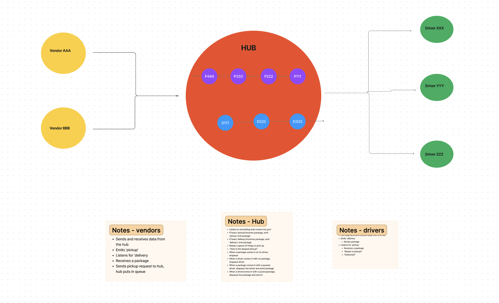

# CAPS aka the Code Academy Parcel Service

[CAPS system overview](https://codefellows.github.io/code-401-javascript-guide/curriculum/apps-and-libraries/caps/)

Lab 11: Phase 1

- For phase 1, we will begin the build of an application for a product called CAPS - The Code Academy Parcel Service. In this sprint, we’ll build out a system that emulates a real world supply chain. CAPS will simulate a delivery service where vendors (such a flower shops) will ship products using our delivery service and when our drivers deliver them, each vendor will be notified that their customers received what they purchased.

The following user/developer stories detail the major functionality for this phase of the project.

- As a vendor, I want to alert the system when I have a package to be picked up.
- As a driver, I want to be notified when there is a package to be delivered.
- As a driver, I want to alert the system when I have picked up a package and it is in transit.
- As a driver, I want to alert the system when a package has been delivered.
- As a vendor, I want to be notified when my package has been delivered.
- And as developers, here are some of the development stories that are relevant to the above.

- As a developer, I want to use industry standards for managing the state of each package.
- As a developer, I want to create an event driven system so that I can write code that happens in response to events, in real time.

Technical requirements:

Global Event Pool (HUB)

- Implement a Module for a Global Event Pool.
  - Export a single EventEmitter from the Node JS module.
  - Should be imported by any module that needs to notify or be alerted by other modules of an event.
- Implement a Module for Managing Global Package Events.
  - Listens to ALL events in the Event Pool.
  - Logs a timestamp and the payload of every event.

Vendor Client Application

- Implement a Module for Managing Vendor Events.
  - Your implementation should use a store name as a parameter.
  - When triggered, the vendor module simulates a pickup event for the given store name to the Global Event Pool:
    - emits pickup to the global event pool.
    - sends a vendor order payload:

Driver Client Application

- Implement a Module for Managing Driver Events.
  - Listens for a pickup event from the Global Event Pool and responds with the following:
    - Log a message to the console: DRIVER: picked up <ORDER_ID>.
    - Emit an in-transit event to the Global Event Pool with the order payload.
    - Log a confirmation message to the console: DRIVER: delivered <ORDER_ID>.
    - Emit a delivered event to the Global Event Pool with the order payload.

Testing

- Write unit tests for each event handler function (not event triggers themselves).
- Use spies to help testing your logger methods (assert that console.log was called right).

Lab 12: Phase 2

**Implementing socket.io**

Phase 2: Continue working on a multi-day build of our delivery tracking system, creating an event observable over a network with Socket.io.

In this phase, we’ll be moving away from using Node Events for managing a pool of events, instead refactoring to using the Socket.io libraries. This allows communication between Server and Client applications.

The intent here is to build the data services that would drive a suite of applications where we can see pickups and deliveries in real-time.

**The following user/developer stories detail the major functionality for this phase of the project.**

- As a vendor, I want to alert the system when I have a package to be picked up.
- As a driver, I want to be notified when there is a package to be delivered.
- As a driver, I want to alert the system when I have picked up a package and it is in transit.
- As a driver, I want to alert the system when a package has been delivered.
- As a vendor, I want to be notified when my package has been delivered.
- As a developer, I want to create network event driven system using Socket.io so that I can write code that responds to events originating from both servers and client applications

Technical Requirements

**The goal of this lab is to create a namespaced Socket.io event server, and to configure Vendor and Driver Client Modules.**

- The Socket Server will create a namespace of caps that will receive all CAPS event traffic.
- Each Vendor and Driver Client will connect to the caps namespace.
- The server will emit specific events to each socket that is listening for their designated events from the Global Event Pool defined in the Server.
- Each Vendor will only emit and listen for specific events based on their Vendor ID. This will be managed by rooms within Socket.io.
- Each Driver will “pick up” a package when the vendor notifies the Server that an “order” is ready and simulate “in-transit” and “delivered” events.

Lab 13: Message Queues

Phase 3: Complete work on a multi-day build of our delivery tracking system, adding queued delivery.

In this phase, we are going to implement a system to guarantee that notification payloads are read by their intended subscriber. Rather than just triggering an event notification and hope that client applications respond, we’re going to implement a “Queue” system so that nothing gets lost. Every event sent will be logged and held onto by the server until the intended recipient acknowledges that they received the message. At any time, a subscriber can get all of the messages they might have missed.

In this final phase, we’ll be implementing a “Queue” feature on the Server, allowing Driver and Vendor clients to subscribe to messages added to pickup and delivered queues.

**The following user/developer stories detail the major functionality for this phase of the project.**

- As a vendor, I want to “subscribe” to “delivered” notifications so that I know when my packages are delivered.
- As a vendor, I want to “catch up” on any “delivered” notifications that I might have missed so that I can see a complete log.
- As a driver, I want to “subscribe” to “pickup” notifications so that I know what packages to deliver.
- As a driver, I want to “catch up” on any “pickup” notifications I may have missed so that I can deliver everything.
- As a driver, I want a way to “scan” a delivery so that the vendors know when a package has been delivered.

- As a developer, I want to create a system of tracking who is subscribing to each event.
- As a developer, I want to place all inbound messages into a “queue” so that my application knows what events are to be delivered.
- As a developer, I want to create a system for communicating when events have been delivered and received by subscribers.
- As a developer, I want to delete messages from the queue after they’ve been received by a subscriber, so that I don’t re-send them.
- As a developer, I want to create a system for allowing subscribers to retrieve all undelivered messages in their queue.

Technical Requirements

Our Server is going to have the same overall functionality, but we want to incorporate a few improvements to existing features:
- We want a feature to keep a log of payloads that reach our system, organized by vendor and event type.
- Payloads are “published” to the appropriate Clients for the appropriate events.
- Client Vendor Applications used by retailers, should subscribe to appropriate Vendor Queues so that they can be alerted when a delivery was made.
- The Client can ask for all undelivered messages from a particular Server Queue.
- When a Client receives a message, it will need to let the hub server know that it was received.
